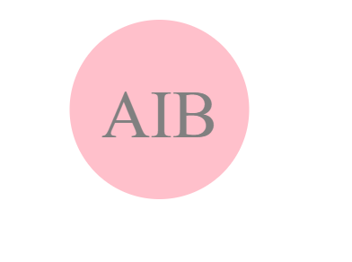

# SVG-logo-maker

## Description
This is a command line application that generates a professional SVG logo. It uses inquirer to prompt users for logo preferences, such as up to three characters of text, text color, and shape (triangle, square, or circle) with a corresponding color. After answering the prompts, the app generates an SVG file with the user's selections. I also implemented unit testing for the first time, with a test suite consisting of three tests to ensure accurate shapes and colors. This app showcases the potential of back-end developers and the importance of unit testing, even for small projects.

## Table of Contents

- [Installation](#installation)
- [Usage](#usage)
- [License](#license)
- [Tests](#tests)

## Installation

This app is powered by Node.js, utilizes inquirer v8.2.4 (node package manager), and file system module (node package manager). It also employs jest v29.7.0 (node package manager) for the unit testing conducted in this application.

## Usage

[Link to My Video](https://drive.google.com/file/d/1xNjNPJ-O7hfRhs_5Yh4fviRh5n_W9mnc/view)

[Link to Github Repository](https://github.com/anicabarrios/SVG-logo-maker)

## License

MIT License

## Tests

Each shape class (Circle, Square, and Triangle) is tested for a render() method that returns a string for the corresponfing SVG file matching color and text requests. Type "npm test" in the command line and Jest will run all three tests.